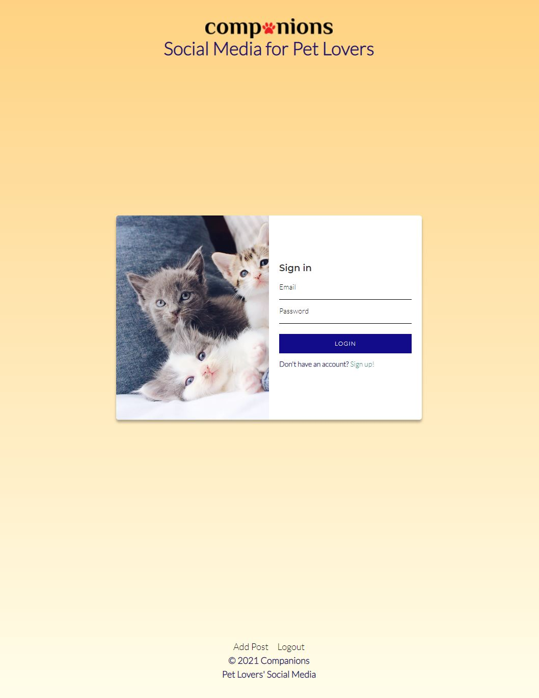

README Content

# Companions

## Description
Within the past decade of social media, influencers have expanded and evolved from fashion, photography, fitness, and food to pets in order to bring joy and laughter to the hearts of millions while showcasing their beloved fur babies. Inpsired by Instagram, Companions is a social media platform for pet lovers and influencers to create accounts for their pets and connect with other pet-loving friends.

If you are one of many who are tired of having to look at pictures of humans on your social network and want to enjoy looking at other furry friends as well as sharing your own, Companions may be the social media app for you!

Deployed live application: https://companion-social-media.herokuapp.com/

## Technologies
- Node
- Express
- Handlebars
- MySQL
- Sequelize
- Sharp
- Multer
- Socket.io

## Features
- Sign up with email
- Log in and out
- Add photos with captions
- Search for other users
- Leave a like and comment

## Future Development
- Follow other users
- Add other users as friends
- User feed for the latest posts from people you follow or your friends
- Direct messaging
- Short video uploading
- Custom user settings
- Sending reset password link in email

## Installation
1. Clone the repository using `git clone <url>`
2. Run `npm install` to install necessary node modules
3. Run `npm start`

## Demo

## License

See the [LICENSE](LICENSE) file for license rights and limitations (MIT).
