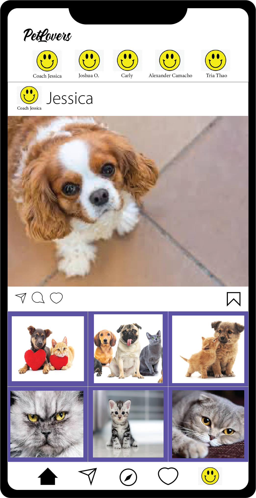

README Content

# Companion

## Description
Within the past decade of social media, influencers have expanded and evolved from fashion, photography, fitness, and food to pets in order to bring joy and laughter to the hearts of millions while showcasing their beloved fur babies. If you are one of many that are tired of having to look at pictures of humans on your social network and want to enjoy looking at other furry friends as well as sharing your own, Companion may be the social media app for you!

Inpsired by Instagram, Companion is a social media platform for pet lovers and influencers to create accounts for their pets and connect with other pet-loving friends. Companion currently has the following features: the ability to create an account, log in and out, add photos with captions, search for other users, and leave a like and comment.

For future development we plan on implementing the following features: follow other users, add other users as friends, user feed for the latest posts from people you follow or your friends, directly message other users, and the option to upload short videos on your profile.

Bonus: set up the application to send the user an email for various reasons.

## Technologies to Use:
Node
Express
Handlebars
MYSQL
Sequelize
Sharp
Multer
Socket.io

## User Story
As a companion user, I want to be able to create or log in to my own account. I want to be able to add my own post an image with a caption. I want to be able to access the latest posts from accounts that I search as well as leave a like and comment. 